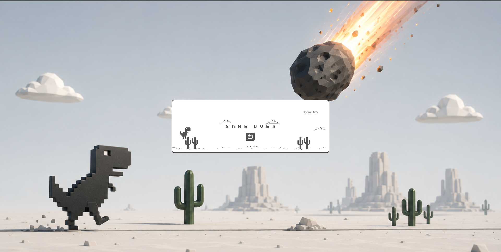

# T-Rex Run

T-Rex Meteor Run is a browser-based endless runner game inspired by the classic Chrome Dino game. Built using **JavaScript**, **p5.js**, and **p5.play**, the game challenges players to survive as long as possible by jumping over cacti while a massive meteor looms in the background. As the score increases, the game becomes progressively faster, testing the player's timing and reflexes.

This project was developed to explore game development concepts such as sprite animation, collision detection, score tracking, game states, obstacle generation, and interactive gameplay while recreating and enhancing the iconic offline dinosaur runner experience.

---

## Preview

### Gameplay


### Game Over Screen



---

## Features

* Endless runner gameplay inspired by Chrome Dino
* Smooth T-Rex running and jumping animations
* Dynamic obstacle spawning system
* Increasing game speed based on score
* Real-time score tracking
* High score saving using browser localStorage
* Game Over and Restart functionality
* Animated cloud generation
* Custom 3D meteor-themed background
* Responsive and lightweight browser experience

---

## Technologies Used

* JavaScript
* p5.js
* p5.play
* HTML5
* CSS3

---

## Getting Started

### Clone the Repository

```bash
git clone https://github.com/dslord/T-Rex-Meteor-Run.git
cd T-Rex-Meteor-Run
```

### Run the Project

Open `index.html` in your preferred web browser.

---

## Gameplay

1. Launch the game.
2. Press the **Spacebar** to make the T-Rex jump.
3. Avoid incoming cactus obstacles.
4. Earn points by surviving longer.
5. Try to beat your highest score.
6. Click the restart button after a collision to play again.

---

## Project Structure

```text
├── Game/
│   └── sketch.js
│
├── sprites/
│   ├── bg.png
│   ├── cloud.png
│   ├── gameOver.png
│   ├── ground2.png
│   ├── obstacle1.png
│   ├── obstacle2.png
│   ├── obstacle3.png
│   ├── obstacle4.png
│   ├── obstacle5.png
│   ├── obstacle6.png
│   ├── restart.png
│   ├── trex1.png
│   ├── trex2.png
│   ├── trex3.png
│   └── trex_collided.png
│
├── src/
│   ├── p5.js
│   ├── p5.dom.min.js
│   ├── p5.play.js
│   └── p5.sound.min.js
│
├── assets/
│   ├── Preview1.png
│   └── Preview2.png
│
├── LICENSE
├── index.html
├── style.css
└── README.md
```

---

## Controls

| Key | Action |
|------|---------|
| Spacebar | Jump |
| Mouse Click | Restart Game |

---

## Game Mechanics

| Feature | Description |
|----------|-------------|
| Obstacles | Random cactus variants spawn continuously |
| Difficulty Scaling | Game speed increases with score |
| Score System | Score increases over time |
| High Score | Saved using localStorage |
| Collision Detection | Ends the game on contact with obstacles |
| Restart System | Allows instant replay after Game Over |

---

## Contributing

Contributions are welcome. Feel free to fork the repository, create a feature branch, and submit a pull request.

---

## License

This project is licensed under the MIT License. See the LICENSE file for details.

---

Developed by **dslord**.
